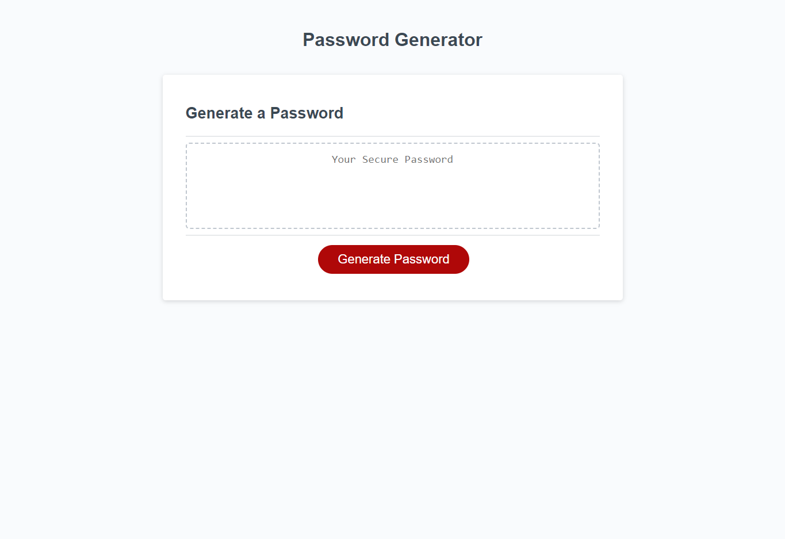

# javascript-random-password-generator

## **Link to deployed application**
https://jjgavery.github.io/javascript-random-password-generator/

## **Description**
In this challenge I was presented with starter code in html, css and javascript. There were no modifications needed to the html or css code. I was instructed to add code to the javascript file to produce a random password consisting of lowercase letters, uppercase letters, special characters and numbers. When you navigate to the webpage there is a button you will click to enter your inputs to request a password. You have to choose between 8 and 128 characters. You will also have the option to choose if you want your password to have lowercase letters, uppercase letters, special characters and numbers. You can choose just one of the input options or you can choose to have all of them. After you choose how many input options you want your random generated password will be created and displayed in the text box above the generate password button.  

## **Technologies**
- HTML
- CSS
- JAVASCRIPT

## **Preview**
   
